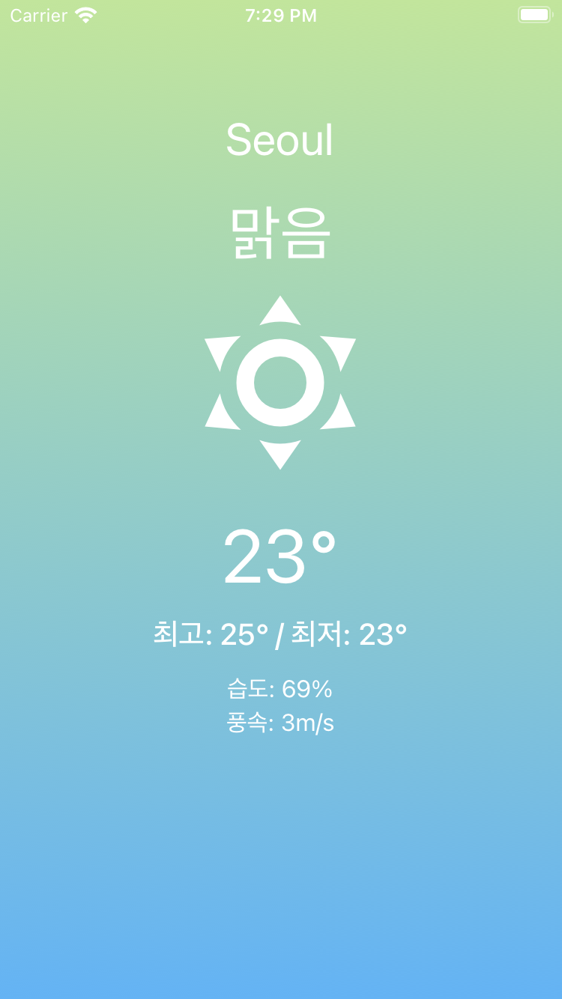
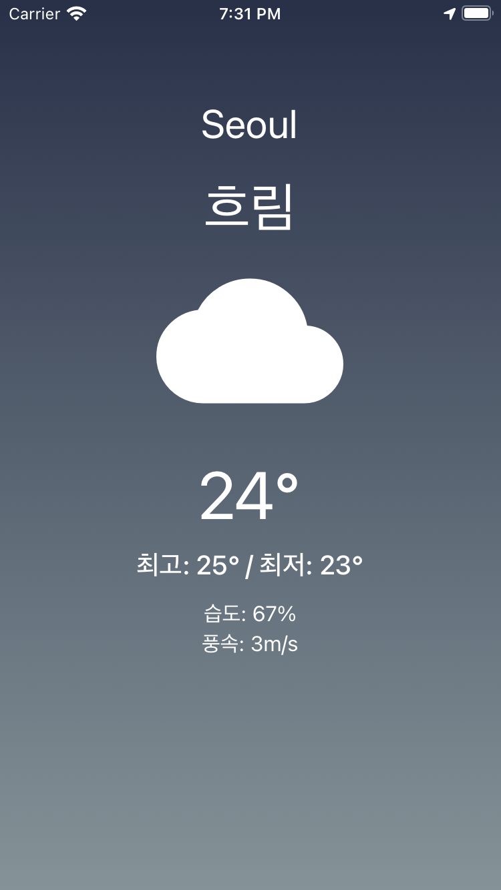
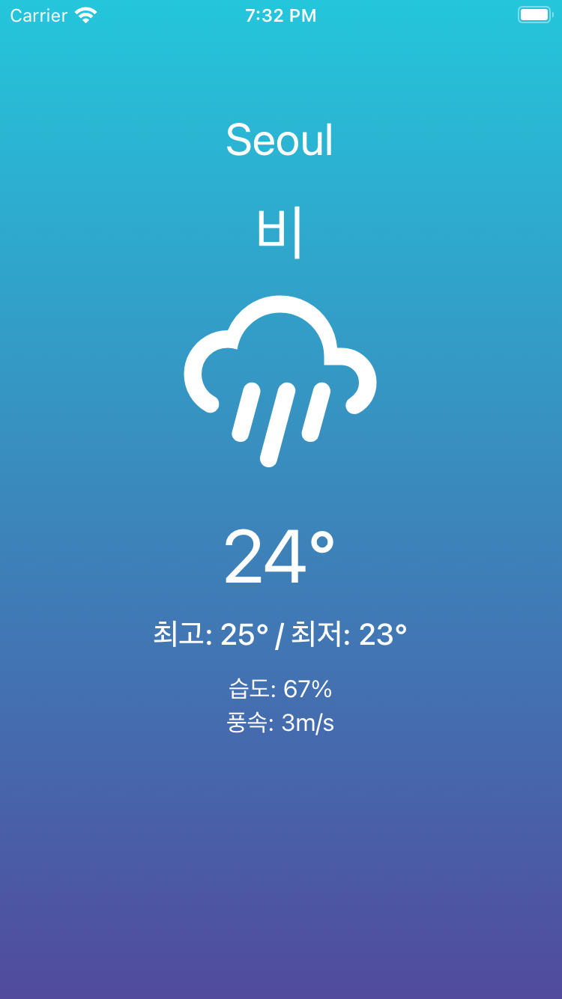
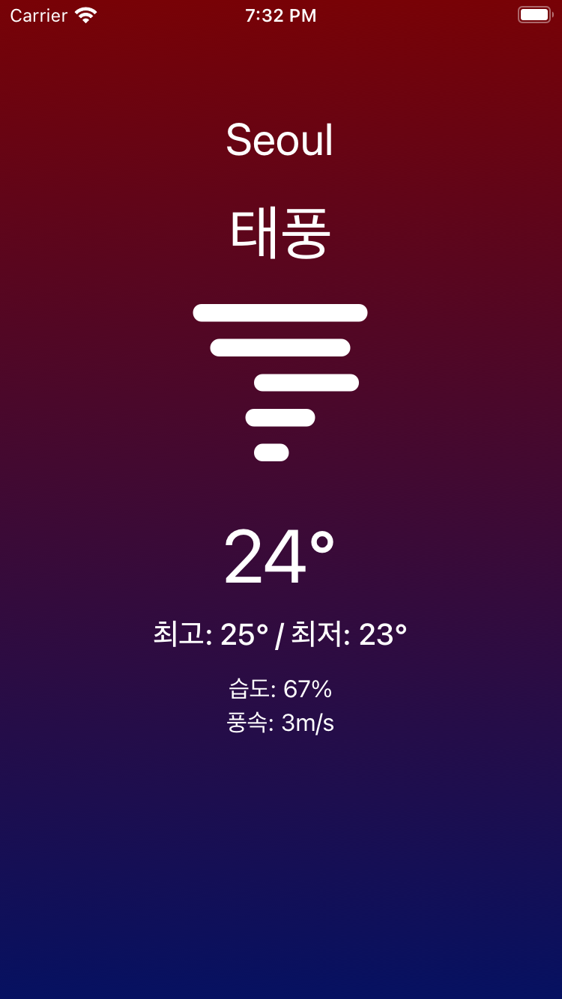

# React-Native-Weather-App

## 🔗 Demo

https://expo.dev/@sugargw/weather-app

## 🖥 Preview

   

## 🔥 Stack

### Front-end

 

## ✅ Packages

- [x] React
- [x] React Native
- [x] Expo
- [x] Axios

## 📖 Theory

- [x] Expo
- [x] Styles on React Native
- [x] Data Fetching
- [x] Geolocation
- [x] Permissions
